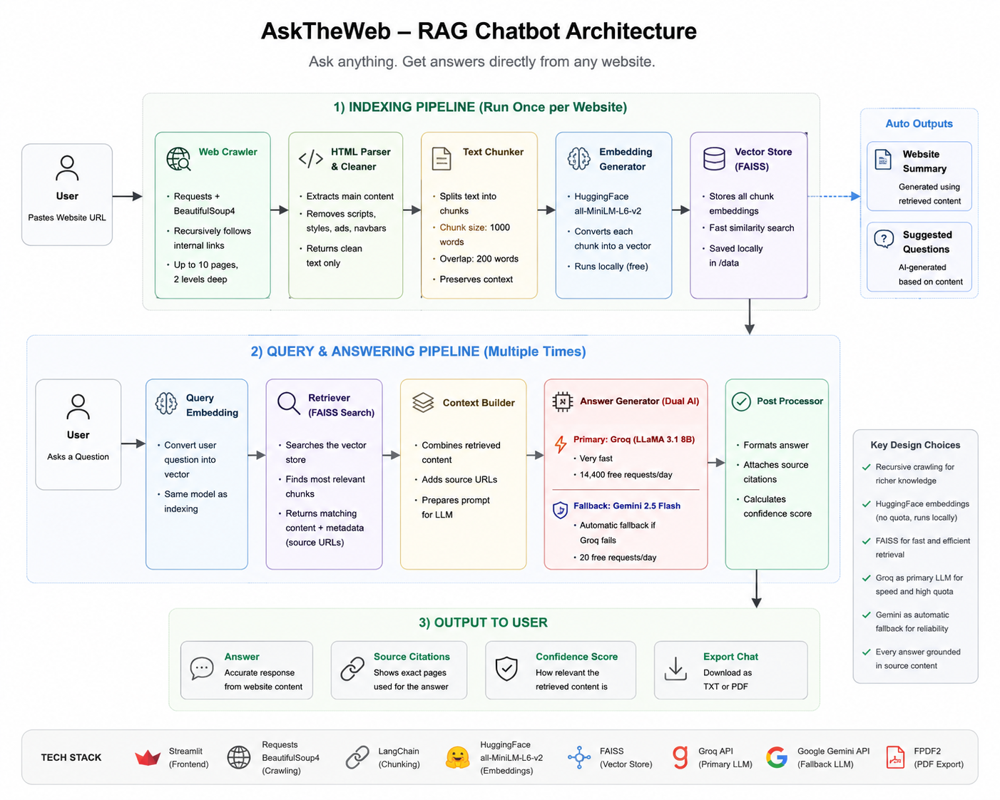
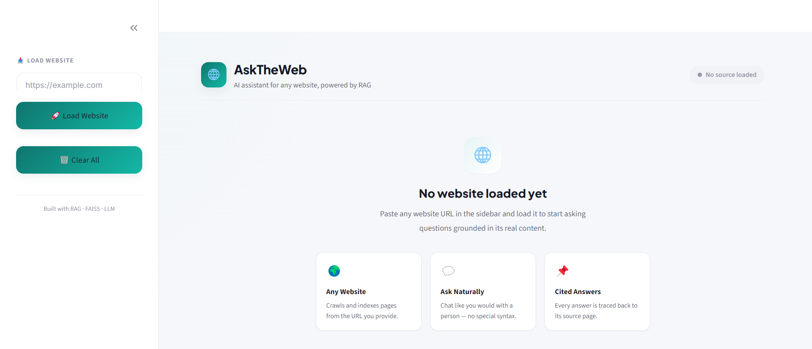
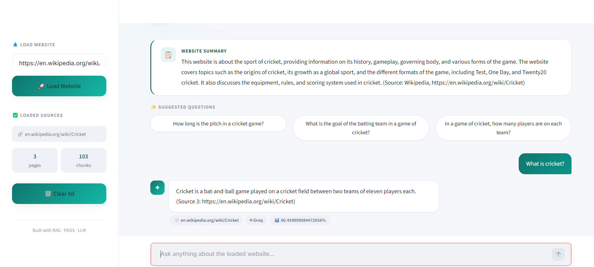

# AskTheWeb 🌐
**Ask anything. Get answers directly from any website.**

🚀 **Live Demo** → [https://asktheweb-rag-chatbot-2.streamlit.app](https://asktheweb-rag-chatbot-2.streamlit.app)

---

## What is this?

AskTheWeb lets you have a conversation with any website. You paste a URL, the app reads through the pages, builds a knowledge base from the content, and then answers your questions accurately — with sources.

Grounds every answer in the retrieved website content and provides source citations.

---

## Why I built it this way

Most RAG chatbots stop at one page. AskTheWeb recursively follows links and reads multiple pages automatically, so you get a much richer knowledge base to work with.

I also wanted it to never go down during a demo. So I connected two AI models — Groq as the primary (14,400 free requests/day) and Gemini as the automatic fallback. If one fails, the other takes over silently.

---

## Live Demo

👉 [Try it here](https://asktheweb-rag-chatbot-2.streamlit.app)

Load any public website URL and start asking questions. Try it with:
- `https://en.wikipedia.org/wiki/Cricket`
- `https://en.wikipedia.org/wiki/Artificial_intelligence`
- Any company's about page or documentation site

---

## Features

- Recursive web crawling — follows internal links automatically
- Smart link filtering — skips login pages, social links, irrelevant pages
- Chunking with overlap — preserves context across chunk boundaries
- FAISS vector search — finds the most relevant content in milliseconds
- Dual AI setup — Groq (LLaMA 3.1) primary, Gemini 2.5 Flash backup
- Auto website summary — generated the moment you load a URL
- Suggested questions — AI suggests what you might want to ask
- Source citations — every answer shows exactly which page it came from
- Confidence score — shows how relevant the retrieved content is
- Chat export — download your conversation as TXT or PDF
- Full error handling — invalid URLs, blocked sites, empty pages all handled cleanly

---

## How it works
User pastes a URL

↓

Crawler fetches the page and follows internal links (up to 10 pages)

↓

HTML is parsed and cleaned into plain text

↓

Text is split into overlapping chunks of 1000 words

↓

HuggingFace embeddings convert each chunk into a vector

↓

All vectors stored in a local FAISS index

↓

User asks a question

↓

Question converted to vector → FAISS finds top 3 matching chunks

↓

Chunks + question sent to Groq (or Gemini if Groq fails)

↓

Answers returned with source URL and confidence score

---
# Architecture



---
## Screenshots

### Home screen


### Chat in action



## Project structure
AskTheWeb/

│

├── app.py                  — Streamlit UI and app logic

│

├── scraper/

│   ├── crawler.py          — Recursive web crawler

│   ├── parser.py           — HTML parser and text extractor

│   └── filters.py          — Link filter (skips useless pages)

│

├── rag/

│   ├── chunker.py          — Splits text into overlapping chunks

│   ├── embedder.py         — HuggingFace embeddings + FAISS index

│   ├── retriever.py        — Semantic search over stored chunks

│   └── generator.py        — Groq + Gemini answer generation

│

├── utils/

│   ├── url_utils.py        — URL normalization and validation

│   └── file_utils.py       — File save and load helpers

│

├── data/                   — FAISS index storage (local)

├── requirements.txt        — Python dependencies

├── .gitignore              — Excludes .env, venv, cache files

└── README.md
---

## Tech stack

| Layer | Tool | Why |
|-------|------|-----|
| UI | Streamlit | Fast to build, easy to demo |
| Scraping | Requests + BeautifulSoup4 | Lightweight, reliable |
| Chunking | LangChain RecursiveTextSplitter | Preserves paragraph context |
| Embeddings | HuggingFace all-MiniLM-L6-v2 | Free, runs locally, no quota |
| Vector DB | FAISS | Millisecond search, no server needed |
| Primary AI | Groq (LLaMA 3.1 8B) | 14,400 free requests/day, very fast |
| Backup AI | Gemini 2.5 Flash | Auto fallback when Groq fails |
| PDF Export | fpdf2 | Lightweight PDF generation |
| Config | python-dotenv | Keeps API keys out of code |

---

## Setup and run locally

### 1. Clone the repo
```bash
git clone https://github.com/Sivabakkiyan/asktheweb-rag-chatbot.git
cd asktheweb-rag-chatbot
```

### 2. Create virtual environment
```bash
python -m venv venv
venv\Scripts\activate        # Windows
source venv/bin/activate     # Mac/Linux
```

### 3. Install dependencies
```bash
pip install -r requirements.txt
```

### 4. Add API keys
Create a `.env` file in the root folder:

GEMINI_API_KEY=your_gemini_key

GROQ_API_KEY=your_groq_key

GOOGLE_API_KEY=your_gemini_key

Get your free keys:
- Groq → [console.groq.com](https://console.groq.com) (14,400 requests/day)
- Gemini → [aistudio.google.com](https://aistudio.google.com) (backup)

### 5. Run
```bash
streamlit run app.py
```

Open `http://localhost:8501` in your browser.

---

## API limits

| Service | Free limit | Role |
|---------|-----------|------|
| Groq | Generous free tier | Primary AI |
| Gemini | Free tier | Automatic backup |
| HuggingFace embeddings | Unlimited | Runs locally |

---

## What I learned building this

Getting recursive crawling right was harder than expected — Wikipedia alone has thousands of internal links, so without proper depth and page limits the crawler would run forever. The fix was limiting to 2 levels deep and capping at 10 pages, while filtering out navigation, login, and irrelevant links.

The embedding quota issue with Gemini taught me to always have a local fallback — HuggingFace's `all-MiniLM-L6-v2` runs entirely on your machine, so there is no quota to hit.

The dual AI setup came from a real problem during testing — Gemini's free tier has a 20 request/day limit which ran out quickly. Groq solved this with its much more generous free tier, and keeping Gemini as a silent backup means the app never goes down.

---

